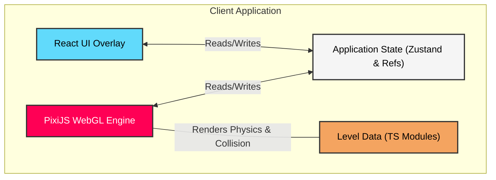

# Echo Drift

Echo Drift is an immersive WebGL-based puzzle platformer game where players engage in time-bending mechanics. You must navigate through shattered temporal sectors, avoiding your past actions ("echoes") while leveraging agility and timing to resolve temporal paradoxes and restore stability to the timeline.

## Project Overview

This project showcases a seamless integration between a high-performance WebGL game engine (PixiJS) and a modern, high-fidelity UI framework (React). It focuses on providing a responsive, 60fps gameplay experience overlayed with an aesthetic, temporal-themed dashboard.

## Key Features & Functionality

*   **Temporal Echo Mechanic:** Every movement is recorded. Your past "echo" follows you, acting as an unpredictable hazard. Colliding with your recent echo results in a destructive time paradox (game over).
*   **Dynamic UI Overlay:** A sleek React-based HUD interfaces with the game engine, displaying real-time metrics such as player velocity, timeline stability, and game progress.
*   **Interactive Environments:** Navigate through levels featuring crumbling platforms, laser doors, switches, and patrolling enemies, all handled with a custom AABB collision detection system.
*   **Smooth Transitions:** Progressive level advancement with seamless transitions between the game canvas and React UI screens (Main Menu, Success/Failed states).

## Technical Specifications

*   **Frontend Framework:** React 18, utilizing functional components and hooks.
*   **Language:** TypeScript (Strict Mode) across both the UI and Engine.
*   **Game Engine:** PixiJS (v8) for 2D WebGL rendering, optimized for dynamic resizing with high DPI support.
*   **Module Bundler:** Vite for fast HMR and optimized production builds.
*   **Styling:** Custom CSS tailored to mimic a high-end design system, focusing on deep blacks, vibrant neon highlights, and glassmorphic card overlays.

## System Architecture

Below is the conceptual architecture outlining how the React UI, PixiJS Game Engine, and underlying game state interact within the frontend client:

## Getting Started

1.  **Clone the repository** and navigate to learning directory.
2.  **Install dependencies:** `npm install`
3.  **Start Dev Server:** `npm run dev`
4.  **Build for Production:** `npm run build`
